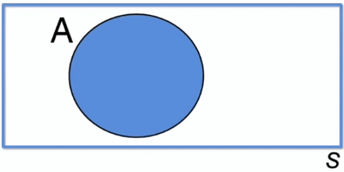
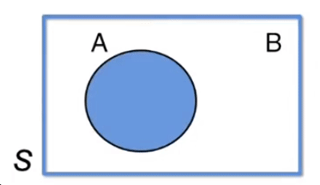
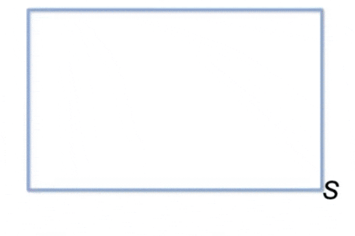

# Probabilidade em espaços discretos - Parte 1 - Probabilidade e Estatística | Aula 3

## Probabilidade

Probabilidade é o estudo da **aleatoriedade e da incerteza**. É a quantificação sobre o conhecimento que temos de um determinado **evento**.

## Experimentos

Existem dois tipos de experimentos:

* **Determinísticos** - Um evento em que os resultados podem ser previstos
* **Aleatório** - Um experimento em que os resultados são diferentes em cada vez que ele é repetido.

## Espaço amostral

A relação de todos os resultados possíveis de um experimento é o **espaço amostral**. O espaço amostral é denotado pela letra "S".

## Eventos

Um subconjunto do espaço amostral é um **evento**. Pode ser constituído por um ou masi resultados.****

## Operações entre eventos

Para calcular a probabilidade de um evento ocorrer, antes de realizar o experimento, devemos angariar todas as informações que pudermos, sobre o evento, e calcular as **probabilidades de cada evento elementar** que compõe o evento complexo que se deseja conhecer. Para isso, usamos as operações entre eventos.

### União

A operação $A \cup B$ acontece quando acontecer ou o evento $A$, ou o evento $B$, ou os dois. Ou seja, quando ocorrer **algum** um dos eventos.

### Interseção

A operação de $A \cap B$ acontece quando ocorre o evento $A$ **E** o evento $B$. Ou seja, quando ocorrem **os dois eventos**.

### Complementar

O evento $\bar A$ (complementar) é formado pelos resultados que não pertencem ao evento considerado. Ou seja, o evento complementar significa a **não ocorrência** do evento considerado.

## Eventos mutuamente excludentes

Quando dois eventos $A$ e $B$ ($A \cap B = \varnothing$) não possuirem nenhum resultado em comum, significa que esses eventos são mutualmente exclusivos. OU seja: quando um acontece, o outro não pode acontecer.

---
[$\blacktriangleleft$ Aula Anterior](README.md) | [Início](README.md) | [Próxima Aula $\blacktriangleright$](aula-04.md)