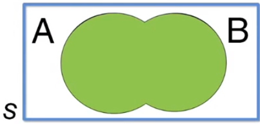
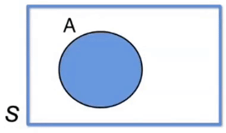

# Teoremas de probabilidade - Parte 1 - Probabilidade e Estatística | Aula 8

Para calcular a probabilidade de um evento complexo, nós decompomos esse evento em em eventos elementares e calculamos as probabilidades desses eventos elementares. Então, aplicando os teoremas de Probabilidade, a partir das probabilidades elementares, nós usamos as operações com eventos para calcular a probabilidade do evento complexo.

Cada uma das operações com eventos tem a sua correspondência num Teorema da Probabilidade.

## Teorema do Evento complementar

O evento complementar é a não ocorrência do evento.

A probabilidade da ocorrência do evento complementar é 1 menos a probabilidade do evento considerado.

>$P(\bar A) = 1 - P(A)$

**Exemplo:** Se a probabilidade de um aluno não passar de ano é $P(A) = 0,7$, então a probabilidade dele não passar será $P(\bar A) = 1 - 0,7 = 0,3$.

## Teorema da União

>$P (A \cup B) = P(A) + P(B) - P(A \cap B)$

Se os eventos $A$ e $B$ forem mutualmente excludentes, ao cálculo do evento união, é feito simplesmente pela soma das probabilidade dos eventos. Ou seja:

>Se $P(A \cap B) = 0,$ então $P(A \cup B) = P(A) + P(B) $

Para o caso de 3 eventos, temos:

>$P (A \cup B \cup C) = P(A) + P(B) +P(C) - P(A \cap B) - P(A \cap C) - P(B \cap C) + P(A \cap B \cap C)$

## Probabilidade condicionada

Probabilidade condicionada é um segundo evento de um espaço amostral que ocorre em um evento depois que já tenha ocorrido o primeiro.

Para melhor compreensão do que seja probabilidade condicional, considere um espaço amostral $S$ finito não vazio e um evento $A$ de $S$. Se quisermos outro evento $B$ desse espaço amostral $S$, essa nova probabilidade é indicada por $P(B | A)$ e dizemos que é a probabilidade condicional de $B$ em relação a $A$.

Essa probabilidade condicional irá formar um novo espaço amostral, pois agora o espaço amostral será $A$ e os elementos do evento $B$ irão pertencer a $B \cap A$.

Para calcular a probabilidade P(B | A) deve-se seguir o mesmo raciocínio da fórmula $P(A) = \frac{n(A)}{n(S)}$
portanto:

>$P(B | A) = \frac{n(B \cap A)}{n(A)}$ ou $P(B | A) = \frac{P(B \cap A)}{P(A)}$

Sendo que:

>$P(B \cap A) = P(A) . P(B)$

**Exemplo:**

Ao tirar uma carta de um baralho de 52 cartas, qual a probabilidade de sair um Rei de Ouros?

Segundo a definição clássica, a probabilidade é $P(A) = \frac{1}{52}$

Agora vamos realizar novamente a experiência. Embaralhamos o baralho e tiramos 1 carta. Antes de saber qual a carta, algúem lhe dá uma informação: essa carta é uma figura. Qual a probabilidade de sair novamente um Rei de Ouros?

Um baralho tem 4 naipes (ouros, paus, espada e coração) e cada naipe tem 3 figuras (J, Q e K), logo um baralho de 52 cartas tem 12 figuras.

Dessa forma, a probabilidade $P(A) = \frac{1}{12}$.

Pelo caso acima podemos concluir que o papel da **nova informação** é **reduzir o espaço amostral**, restringindo o número de possibilidades, criando um espaço amostral diferente.

## Teorema da Intersecção ou Teorema do Produto

>$P(A \cap B) = P(A) . P(B | A)$ ou $P(B \cap A) = P(B) . P(A | B)$

Ou seja, para que aconteça $A \cap B$, é necessário impor que aconteça $A$ e depois é necessário impor que conteça $B$, dado que o eventyo $A$ já tenha acontecido.

### Generalização para 3 eventos

>$P(A \cap B \cap C) = P(B) . P(B | A) . P(C | A \cap B)$

## Eventos Independentes

Dois eventos são chamados independentes quando a probabilidde de acontecer um dado que aconteceu outro, é igual à probabilidade sem informação nenhuma. Ou seja:

>$P(A | B) = P(A)$

Portanto, a informação sobre o evento $B$ não altera a probabilidade de ocorrência de $A$.

### Teorema do Produto Simplificado

No caso especial de eventos independentes, o teorema do produto para dois eventos é:

>$P(A \cap B) = P(A) . P(B)$

Generealizando para K eventos:

>$P(A \cap B \cap ... \cap K) = P(A) . P(B) . ... . P(K)$
---

[$\blacktriangleleft$ Aula Anterior](aula-07.md) | [Início](README.md) | [Próxima Aula $\blacktriangleright$](aula-09.md)