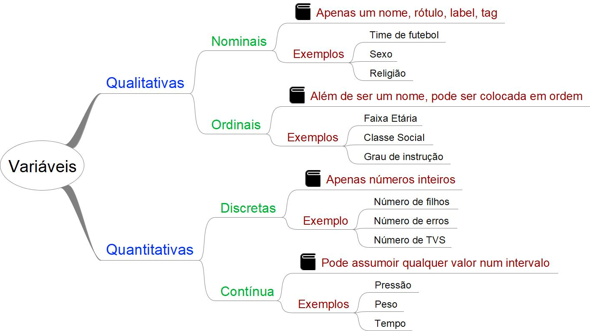

## Variáveis estatísticas

Variável é algo que varia de elemento para elemento. São as características mensuráveis de uma população que usamos para classificar os indivíduos dessa população. É através da identificação e estudo das variáveis que podemos caracterizar, classificar e comparar grupos de uma população.

Existem 2 tipos de variáveis: qualitativas e quantitativas.

{: .responsive-img}

### Variáveis qualitativas

Variáveis qualitativas (categóricas) são aquelas descritas por nomes (qualidades), ou seja, elas não podem ser medidas.

Podem ser de dois tipos:

- Nominais: os valores são apenas nomes, rótulos.
  - Exemplo -  sexo, religião, time, cor dos olhos,
- Ordinais: mesmo não sendo números, os valores podem ser classificados em uma ordem.
  - Exemplo:
    - classe social: A, B, C, D, E
    - grau de instrução: ensino fundamental, médio, nível superior, pós graduação, mestrado, doutorado
    - Grau de concordância de uma pessoa em relação a um assunto: discordo fortemente, discordo pouco,  concordo pouco, concordo fortemente

### Variáveis quantitativas

Variáveis quantitativas são aquelas que podemos medir e representar através de números.

Podem ser de dois tipos:

- Discretas: os valores são números inteiros
  - Exemplo: número de filhos, número de erros
- Contínuas: podem assumir qualquer valores dentro de um intervalo.
  - Exemplo: Temperatura, peso, distância, tempo
